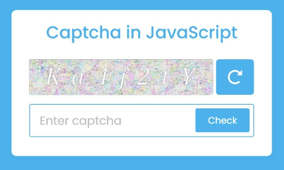
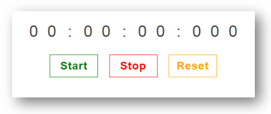
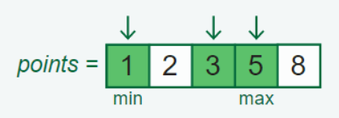

# JavaScript Program Writing

<br/>

## Q. Write a function to transform json in group by parameter?

**Examples:**

```js
[ 
    { Phase: "Phase 1", Step: "Step 1", Task: "Task 1", Value: "5"},
    { Phase: "Phase 1", Step: "Step 1", Task: "Task 2", Value: "10"},
    { Phase: "Phase 1", Step: "Step 2", Task: "Task 1", Value: "15"},
    { Phase: "Phase 1", Step: "Step 2", Task: "Task 2", Value: "20"},
    { Phase: "Phase 2", Step: "Step 1", Task: "Task 1", Value: "25"},
    { Phase: "Phase 2", Step: "Step 1", Task: "Task 2", Value: "30"}
];

// Output: Group By 'Phase'
{
  'Phase 1': [
    { Phase: 'Phase 1', Step: 'Step 1', Task: 'Task 1', Value: '5' },
    { Phase: 'Phase 1', Step: 'Step 1', Task: 'Task 2', Value: '10' },
    { Phase: 'Phase 1', Step: 'Step 2', Task: 'Task 1', Value: '15' },
    { Phase: 'Phase 1', Step: 'Step 2', Task: 'Task 2', Value: '20' }
  ],
  'Phase 2': [
    { Phase: 'Phase 2', Step: 'Step 1', Task: 'Task 1', Value: '25' },
    { Phase: 'Phase 2', Step: 'Step 1', Task: 'Task 2', Value: '30' }
  ]
}
```

<details><summary><b>Answer</b></summary>

```javascript
const groupBy = function (items, key) {
  return items.reduce(function (result, item) {
    (result[item[key]] = result[item[key]] || []).push(item);
    return result;
  }, {});
};

console.log(groupBy(arry, "Phase"));
```

</details>

<div align="right">
    <b><a href="#javascript-coding-practice">↥ back to top</a></b>
</div>

## Q. Write a function to transform json in group by id?

**Examples:**

```js
Input:

[
  { id: 1, type: "ADD" },
  { id: 1, type: "CHANGE" },
  { id: 2, type: "ADD" },
  { id: 3, type: "ADD" },
  { id: 3, type: "CHANGE" },
  { id: 2, type: "REMOVE" },
  { id: 3, type: "CHANGE" },
  { id: 1, type: "REMOVE" },
];

Output:

[
  { id: 1, type: ["ADD", "CHANGE", "REMOVE"] },
  { id: 2, type: ["ADD", "REMOVE"] },
  { id: 3, type: ["ADD", "CHANGE", "CHANGE"] },
];
```

<details><summary><b>Answer</b></summary>

```javascript
const groupBy = (arr = []) => {
   const result = [];
   const map = {};
   for (let i = 0, j = arr.length; i < j; i++) {
      let element = arr[i];
      if (!(element.id in map)) {
         map[element.id] = {id: element.id, type: []};
         result.push(map[element.id]);
      };
      map[element.id].type.push(element.type);
   };
   return result;
};

console.log(groupBy(arr));
```

</details>

<div align="right">
    <b><a href="#javascript-coding-practice">↥ back to top</a></b>
</div>

## Q. Write a function to find non-repetitive numbers in a given array?

**Examples:**

```js
Input:
[2, 3, 4, 3, 3, 2, 4, 9, 1, 2, 5, 5]

Output:
[9, 1]
```

<details><summary><b>Answer</b></summary>

```javascript
// Creating Object with number of occurance of each elements
for(let element of arr) {
   if(count[element]) {
      count[element] += 1;
   } else {
      count[element] = 1;
   }
}

// Iterate Unique elements
for(let key in count) {
    if(count[key] === 1) {
       console.log(key + '->' + count[key]); 
    }
}
```

</details>

<div align="right">
    <b><a href="#javascript-coding-practice">↥ back to top</a></b>
</div>

## Q. Write a function to accept argument like `sum(num1)(num2);` or `sum(num1,num2);`

**Examples:**

```js
Input: sum(10)(20);
Output: 30
Explanation: 10 + 20 = 30

Input: sum(10, 20);
Output: 30
Explanation: 10 + 20 = 30
```

<details><summary><b>Answer</b></summary>

```javascript
function sum(x, y) {
  if (y !== undefined) {
    return x + y;
  } else {
    return function (y) {
      return x + y;
    };
  }
}

console.log(sum(10, 20));
console.log(sum(10)(20));
```

**&#9885; [Try this example on CodeSandbox](https://codesandbox.io/s/js-cp-1-ypmjhl?file=/src/index.js)**

</details>

<div align="right">
    <b><a href="#javascript-coding-practice">↥ back to top</a></b>
</div>

## Q. Write a function to get the difference between two arrays?

**Example:**

```js
Input:
['a', 'b'];
['a', 'b', 'c', 'd'];

Output:
["c", "d"]
```

<details><summary><b>Answer</b></summary>

```js
let arr1 = ['a', 'b'];
let arr2 = ['a', 'b', 'c', 'd'];

let difference = arr2.filter(x => !arr1.includes(x));
```

</details>

<div align="right">
    <b><a href="#javascript-coding-practice">↥ back to top</a></b>
</div>

## Q. Write a function to accept argument like `[array1].diff([array2]);`

**Example:**

```js
Input: [1, 2, 3, 4, 5, 6].diff([3, 4, 5]);
Output: [1, 2, 6];
```

<details><summary><b>Answer</b></summary>

```js
Array.prototype.diff = function (a) {
  return this.filter(function (i) {
    return a.indexOf(i) < 0;
  });
};

const dif1 = [1, 2, 3, 4, 5, 6].diff([3, 4, 5]);
console.log(dif1); // => [1, 2, 6]
```

</details>

<div align="right">
    <b><a href="#javascript-coding-practice">↥ back to top</a></b>
</div>

## Q. Validate file size and extension before file upload in JavaScript?

```js
Output:

File Name: pic.jpg 
File Size: 1159168 bytes 
File Extension: jpg 
```

<details><summary><b>Answer</b></summary>

```html
<!DOCTYPE html>
<html>
  <head>
    <script type="text/javascript">
      function showFileSize() {
        var input, file, extension;

        input = document.getElementById("fileinput");
        file = input.files[0];
        extension = file.name.substring(file.name.lastIndexOf(".") + 1);

        let result = "File Name: " + file.name;
        result += "<br/>File Size: " + file.size + " bytes";
        result += "<br/>File Extension: " + extension;
        document.getElementById("result").innerHTML = result;
      }
    </script>
  </head>

  <body>
    <form action="#" onsubmit="return false;">
      <input type="file" id="fileinput" />
      <br /><br />
      <input
        type="button"
        id="btnLoad"
        value="Upload"
        onclick="showFileSize();"
      />
    </form>
    <div id="result"></div>
  </body>
</html>
```

**&#9885; [Try this example on CodeSandbox](https://codesandbox.io/s/js-cp-file-upload-fj17kh?file=/index.html)**

</details>

<div align="right">
    <b><a href="#javascript-coding-practice">↥ back to top</a></b>
</div>

## Q. Create a captcha using javascript?

<p align="center">
  
</p>

<details><summary><b>Answer</b></summary>

```html
<!DOCTYPE html>
<html>
  <head>
    <title>JavaScript Captcha Generator</title>
  </head>
  <script>
    const randomString =
      "0123456789abcdefghijklmnopqrstuvwxyzABCDEFGHIJKLMNOPQRSTUVWXYZ@!#$%^&*";

    function generateCaptcha() {
      let captcha = "";
      for (let i = 0; i < 6; i++) {
        captcha += randomString.charAt(Math.random() * randomString.length);
      }
      document.getElementById("captcha").value = "";
      document.getElementById("captcha").value = captcha;
    }
  </script>

  <body onload="generateCaptcha()">
    <input type="text" id="captcha" disabled /><br /><br />
    <button onclick="generateCaptcha()">Refresh</button>
  </body>
</html>
```

**&#9885; [Try this example on CodeSandbox](https://codesandbox.io/s/js-cp-captcha-mzyi2n?file=/index.html)**

</details>

<div align="right">
    <b><a href="#javascript-coding-practice">↥ back to top</a></b>
</div>

## Q. Create a stopwatch in javascript?

<p align="center">
  
</p>

<details><summary><b>Answer</b></summary>

```html
<!DOCTYPE html>
<html>
  <head>
    <title>Stopwatch Example</title>
  </head>

  <body>
    <h4>Time: <span id="time">00:00:00</span><h4> <br /><br />
    <button id="start" onclick="start()">Start</button>
    <button id="stop" onclick="stop()">Stop</button>
    <button id="reset" onclick="reset()">Reset</button>

    <script type="text/javascript">
      const time = document.getElementById("time");
      const startBtn = document.getElementById("start");

      let timer;
      let seconds = 0;
      let hours = 0;
      let minutes = 0;
      let MINUTES_IN_HOUR = 60;
      let SECONDS_IN_MINUTE = 60;

      function updateTimer() {
        seconds++;
        if (seconds >= SECONDS_IN_MINUTE) {
          seconds = 0;
          minutes++;
          if (minutes >= MINUTES_IN_HOUR) {
            minutes = 0;
            hours++;
          }
        }

        time.textContent =
          (hours ? (hours > 9 ? hours : "0" + hours) : "00") +
          ":" +
          (minutes ? (minutes > 9 ? minutes : "0" + minutes) : "00") +
          ":" +
          (seconds > 9 ? seconds : "0" + seconds);

        // start timer again
        start();
      }

      function start() {
        timer = setTimeout(updateTimer, 1000);
        startBtn.disabled = true;
      }

      function stop() {
        clearTimeout(timer);
        startBtn.disabled = false;
      }

      function reset() {
        time.textContent = "00:00:00";
        seconds = 0;
        minutes = 0;
        hours = 0;
        startBtn.disabled = false;
      }

      window.start = start;
      window.reset = reset;
      window.stop = stop;
    </script>
  </body>
</html>
```

**&#9885; [Try this example on CodeSandbox](https://codesandbox.io/s/js-cp-stopwatch-j6in1i?file=/index.html)**

</details>

<div align="right">
    <b><a href="#javascript-coding-practice">↥ back to top</a></b>
</div>

## Q. Write a program to reverse a string?

```js
Input: Hello 
Output: olleH
```

<details><summary><b>Answer</b></summary>

```javascript
function reverseString(str) {
  let stringRev = "";
  for (let i = str.length; i >= 0; i--) {
    stringRev = stringRev + str.charAt(i);
  }
  return stringRev;
}
console.log(reverseString("Hello"));
```

**&#9885; [Try this example on CodeSandbox](https://codesandbox.io/s/js-cp-reversestring-sgm1ip?file=/src/index.js)**

</details>

<div align="right">
    <b><a href="#javascript-coding-practice">↥ back to top</a></b>
</div>

## Q. Given a string, reverse each word in the sentence

**Example:**

```js
Input: "Hello World";
Output: "olleH dlroW";
```

<details><summary><b>Answer</b></summary>

```js
const str = "Hello World";

let reverseEntireSentence = reverseBySeparator(str, "");

console.log(reverseBySeparator(reverseEntireSentence, " "));

function reverseBySeparator(string, separator) {
  return string.split(separator).reverse().join(separator);
}
```

</details>

<div align="right">
    <b><a href="#javascript-coding-practice">↥ back to top</a></b>
</div>

## Q. Create a Promise to accept argument and make it resolve if the argument matches with predefined condition?

```js
Input: ['Maruti Suzuki', 'Hyundai', 'Tata Motors', 'Kia', 'Mahindra & Mahindra'];
Key:   Maruti Suzuki
Output:
Maruti Suzuki
```

<details><summary><b>Answer</b></summary>

```js
async function myCars(name) {
  const promise = new Promise((resolve, reject) => {
    name === "Maruti Suzuki" ? resolve(name) : reject(name);
  });

  const result = await promise;
  console.log(result); // "resolved!"
}

myCars("Maruti Suzuki");
```

**&#9885; [Try this example on CodeSandbox](https://codesandbox.io/s/js-promise-1tmrnp?file=/src/index.js)**

</details>

<div align="right">
    <b><a href="#javascript-coding-practice">↥ back to top</a></b>
</div>

## Q. Write a function to merge two JavaScript Object dynamically?

**Example:**

```js
Input:

{
  name: "Tanvi",
  age: 28
};

{
  addressLine1: "Some Location x",
  addressLine2: "Some Location y",
  city: "Bangalore"
};

Output:

// Now person should have 5 properties 
{
  name: "Tanvi",
  age: 28,
  addressLine1: "Some Location x",
  addressLine2: "Some Location y",
  city: "Bangalore"
}
```

<details><summary><b>Answer</b></summary>

```js
/**
 * Using Spread Object
 */

const person = {
  name: "Tanvi",
  age: 28
};

const address = {
  addressLine1: "Some Location x",
  addressLine2: "Some Location y",
  city: "Bangalore"
};


const merged = {...person, ...address};

console.log(merged);
// {name: "Tanvi", age: 28, addressLine1: "Some Location x", addressLine2: "Some Location y", city: "Bangalore"}
```

**&#9885; [Try this example on CodeSandbox](https://codesandbox.io/s/js-shallow-vs-deep-copy-ik5b7h?file=/src/index.js)**

</details>

<div align="right">
    <b><a href="#javascript-coding-practice">↥ back to top</a></b>
</div>

## Q. Being told that an unsorted array contains (n - 1) of n consecutive numbers (where the bounds are defined), find the missing number in O(n) time?

**Example:**

```js
Input:
array = [2, 5, 1, 4, 9, 6, 3, 7];
upperBound = 9;
lowerBound = 1;

Output:
8
```

<details><summary><b>Answer</b></summary>

```js
/**
 *  Find theoretical sum of the consecutive numbers using a variation of Gauss Sum.
 *  Formula: [(Max * (Max + 1)) / 2] - [(Min * (Min - 1)) / 2];
 *  Max is the upper bound and Min is the lower bound
 */
function findMissingNumber(arrayOfIntegers, upperBound, lowerBound) {
  
  var sumOfIntegers = 0;
  for (var i = 0; i < arrayOfIntegers.length; i++) {
    sumOfIntegers += arrayOfIntegers[i];
  }

  upperLimitSum = (upperBound * (upperBound + 1)) / 2;
  lowerLimitSum = (lowerBound * (lowerBound - 1)) / 2;

  theoreticalSum = upperLimitSum - lowerLimitSum;

  return theoreticalSum - sumOfIntegers;
}
```

</details>

<div align="right">
    <b><a href="#javascript-coding-practice">↥ back to top</a></b>
</div>

## Q. Write a function to remove duplicates from an array in JavaScript?

```js
Input: ['John', 'Paul', 'George', 'Ringo', 'John']
Output: ['John', 'Paul', 'George', 'Ringo']
```

<details><summary><b>Answer</b></summary>

**1. Using set():**

```javascript
const names = ['John', 'Paul', 'George', 'Ringo', 'John'];

let unique = [...new Set(names)];
console.log(unique); // 'John', 'Paul', 'George', 'Ringo'
```

**2. Using filter():**

```javascript
const names = ['John', 'Paul', 'George', 'Ringo', 'John'];

let x = (names) => names.filter((v,i) => names.indexOf(v) === i)
x(names); // 'John', 'Paul', 'George', 'Ringo'
```

**3. Using forEach():**  

```javascript
const names = ['John', 'Paul', 'George', 'Ringo', 'John'];

function removeDups(names) {
  let unique = {};
  names.forEach(function(i) {
    if(!unique[i]) {
      unique[i] = true;
    }
  });
  return Object.keys(unique);
}

removeDups(names); // 'John', 'Paul', 'George', 'Ringo'
```

</details>

<div align="right">
    <b><a href="#javascript-coding-practice">↥ back to top</a></b>
</div>

## Q. Use a closure to create a private counter?

**Example:**

You can create a function within an outer function (a closure) that allows you to update a private variable but the variable wouldn\'t be accessible from outside the function without the use of a helper function.

<details><summary><b>Answer</b></summary>

```js
function counter() {
  var _counter = 0;
  // return an object with several functions that allow you
  // to modify the private _counter variable
  return {
    add: function (increment) {
      _counter += increment;
    },
    retrieve: function () {
      return "The counter is currently at: " + _counter;
    },
  };
}

// error if we try to access the private variable like below
// _counter;

// usage of our counter function
var c = counter();
c.add(5);
c.add(9);

// now we can access the private variable in the following way
c.retrieve(); // => The counter is currently at: 14
```

</details>

<div align="right">
    <b><a href="#javascript-coding-practice">↥ back to top</a></b>
</div>

## Q. Write a function to divide an array into multiple equal parts?

**Example:**

```js
Input: [10, 20, 30, 40, 50];
Length: 3
Output: 
[10, 20, 30]
[40, 50]
```

<details><summary><b>Answer</b></summary>

```js
const arr = [10, 20, 30, 40, 50];
let lenth = 3;

function split(len) {
  while (arr.length > 0) {
    console.log(arr.splice(0, len));
  }
}
split(lenth);
```

**&#9885; [Try this example on CodeSandbox](https://codesandbox.io/s/split-array-5od3rz)**

</details>

<div align="right">
    <b><a href="#javascript-coding-practice">↥ back to top</a></b>
</div>

## Q. Write a random integers function to print integers with in a range?

**Example:**

```js
Input: 1, 100
Output: 63
```

<details><summary><b>Answer</b></summary>

```js
/**
 * function to return a random number 
 * between min and max range
 */
function randomInteger(min, max) {
  return Math.floor(Math.random() * (max - min + 1) ) + min;
}

randomInteger(1, 100); // returns a random integer from 1 to 100
```

**&#9885; [Try this example on CodeSandbox](https://codesandbox.io/s/js-random-integers-yd1cy8?file=/src/index.js)**

</details>

<div align="right">
    <b><a href="#javascript-coding-practice">↥ back to top</a></b>
</div>

## Q. Write a function to convert decimal number to binary number?

**Examples:**

```js
Input: 10
Output: 1010

Input: 7
Output: 111
```

<details><summary><b>Answer</b></summary>

```js
function DecimalToBinary(number) {
  let bin = 0;
  let rem,
    i = 1;
  while (number !== 0) {
    rem = number % 2;
    number = parseInt(number / 2);
    bin = bin + rem * i;
    i = i * 10;
  }
  console.log(`Binary: ${bin}`);
}

DecimalToBinary(10);
```

**Example 02:** Convert Decimal to Binary Using `toString()`

```js
let val = 10;

console.log(val.toString(2)); // 1010  ==> Binary Conversion
console.log(val.toString(8)); // 12  ==> Octal Conversion
console.log(val.toString(16)); // A  ==> Hexadecimal Conversion
```

**&#9885; [Try this example on CodeSandbox](https://codesandbox.io/s/js-decimal-to-binary-uhyi8t?file=/src/index.js)**

</details>

<div align="right">
    <b><a href="#javascript-coding-practice">↥ back to top</a></b>
</div>

## Q. Write a function make first letter of the string in an uppercase?

**Example:**

```js
Input: hello world
Output: Hello World
```

<details><summary><b>Answer</b></summary>

You can create a function which uses chain of string methods such as charAt, toUpperCase and slice methods to generate a string with first letter in uppercase.

```js
function capitalizeFirstLetter(string) {
  let arr = string.split(" ");
  for (let i = 0; i < arr.length; i++) {
    arr[i] = arr[i].charAt(0).toUpperCase() + arr[i].slice(1);
  }
  return arr.join(" ");
}

console.log(capitalizeFirstLetter("hello world")); // Hello World
```

**&#9885; [Try this example on CodeSandbox](https://codesandbox.io/s/js-capitalizefirstletter-dpjhky?file=/src/index.js)**

</details>

<div align="right">
    <b><a href="#javascript-coding-practice">↥ back to top</a></b>
</div>

## Q. Write a function which will test string as a literal and as an object?

**Examples:**

```js
Input:  const ltrlStr = "Hi I am string literal";
Output: It is a string literal

Input:  const objStr = new String("Hi I am string object");
Output: It is an object of string
```

<details><summary><b>Answer</b></summary>

The `typeof` operator can be use to test string literal and `instanceof` operator to test String object.

```js
function check(str) {
  if (str instanceof String) {
    return "It is an object of string";
  } else {
    if (typeof str === "string") {
      return "It is a string literal";
    } else {
      return "another type";
    }
  }
}

const ltrlStr = "Hi I am string literal";
const objStr = new String("Hi I am string object");

console.log(check(ltrlStr)); // It is a string literal
console.log(check(objStr)); // It is an object of string
```

**&#9885; [Try this example on CodeSandbox](https://codesandbox.io/s/js-literal-vs-object-978dqw?file=/src/index.js)**

</details>

<div align="right">
    <b><a href="#javascript-coding-practice">↥ back to top</a></b>
</div>

## Q. Write a program to reverse an array?

```js
Input: ["Apple", "Banana", "Mango", "Orange"];
Output: ["Orange", "Mango", "Banana", "Apple"];
```

<details><summary><b>Answer</b></summary>

You can use reverse() method is used reverse the elements in an array. This method is useful to sort an array in descending order.

```js
const fruits = ["Apple", "Banana", "Mango", "Orange"];

const reversed = fruits.reverse();
console.log(reversed); // ["Orange", "Mango", "Banana", "Apple"]
```

</details>

<div align="right">
    <b><a href="#javascript-coding-practice">↥ back to top</a></b>
</div>

## Q. Write a program to find min and max value in an array?

**Example:**

```js
Input: [50, 20, 70, 60, 45, 30];
Output:
Min: 20
Max: 70
```

<details><summary><b>Answer</b></summary>

You can use `Math.min` and `Math.max` methods on array variable to find the minimum and maximum elements with in an array.

```js
const marks = [50, 20, 70, 60, 45, 30];

function findMin(arr) {
  return Math.min.apply(null, arr);
}
function findMax(arr) {
  return Math.max.apply(null, arr);
}

console.log(findMin(marks)); // 20
console.log(findMax(marks)); // 70
```

</details>

<div align="right">
    <b><a href="#javascript-coding-practice">↥ back to top</a></b>
</div>

## Q. Write a program to find min and max values in an array without using Math functions?

**Example:**

```js
Input: [50, 20, 70, 60, 45, 30];
Output:
Min: 20
Max: 70
```

<details><summary><b>Answer</b></summary>

You can write functions which loops through an array comparing each value with the lowest value or highest value to find the min and max values. Let us create those functions to find min an max values,

```js
const marks = [50, 20, 70, 60, 45, 30];

function findMin(arr) {
  let length = arr.length;
  let min = Infinity;
  while (length--) {
    if (arr[length] < min) {
      min = arr[length];
    }
  }
  return min;
}

function findMax(arr) {
  let length = arr.length;
  let max = -Infinity;
  while (length--) {
    if (arr[length] > max) {
      max = arr[length];
    }
  }
  return max;
}

console.log(findMin(marks)); // 20
console.log(findMax(marks)); // 70
```

</details>

<div align="right">
    <b><a href="#javascript-coding-practice">↥ back to top</a></b>
</div>

## Q. Check if object is empty or not using javaScript?

**Example:**

```js
Input:
const obj = {};
console.log(isEmpty(obj)); // true 
```

<details><summary><b>Answer</b></summary>

```javascript
function isEmpty(obj) {
  return Object.keys(obj).length === 0;
}

const obj = {};
console.log(isEmpty(obj)); 
```

**&#9885; [Try this example on CodeSandbox](https://codesandbox.io/s/js-cp-isempty-b7n04b?file=/src/index.js)**

</details>

<div align="right">
    <b><a href="#javascript-coding-practice">↥ back to top</a></b>
</div>

## Q. Write a function to validate an email using regular expression?

**Example:**

```js
Input: 'pradeep.vwa@gmail.com'
Output: true
```

<details><summary><b>Answer</b></summary>

```javascript
function validateEmail(email) {
  const re = /\S+@\S+\.\S+/;
  return re.test(email);
}

console.log(validateEmail("pradeep.vwa@gmail.com")); // true
```

**&#9885; [Try this example on CodeSandbox](https://codesandbox.io/s/js-cp-validateemail-wfopym?file=/src/index.js)**

</details>

<div align="right">
    <b><a href="#javascript-coding-practice">↥ back to top</a></b>
</div>

## Q. Use RegEx to test password strength in JavaScript?

**Example:**

```js
Input: 'Pq5*@a{J'
Output: 'PASS'
```

<details><summary><b>Answer</b></summary>

```javascript
let newPassword = "Pq5*@a{J";
const regularExpression = new RegExp(
  "^(?=.*[a-z])(?=.*[A-Z])(?=.*[0-9])(?=.*[!@#$%^&*])(?=.{8,})"
);

if (!regularExpression.test(newPassword)) {
  alert("Password should contain atleast one number and one special character !");
} else {
  console.log("PASS");
}

// Output
PASS
```

| RegEx            | Description  |
| ---------------- |--------------|
| ^                | The password string will start this way |
| (?=.\*[a-z])     | The string must contain at least 1 lowercase alphabetical character |
| (?=.\*[A-Z])     | The string must contain at least 1 uppercase alphabetical character |
| (?=.\*[0-9])     | The string must contain at least 1 numeric character |
| (?=.[!@#\$%\^&]) | The string must contain at least one special character, but we are escaping reserved RegEx characters to avoid conflict |
| (?=.{8,})        | The string must be eight characters or longer |

**&#9885; [Try this example on CodeSandbox](https://codesandbox.io/s/js-cp-password-strength-cxl8xy)**

</details>

<div align="right">
    <b><a href="#javascript-coding-practice">↥ back to top</a></b>
</div>

## Q. Write a program to count the number of occurrences of character given a string as input?

**Example:**

```js
Input: 'Hello'
Output: 
h: 1
e: 1
l: 2
o: 1
```

<details><summary><b>Answer</b></summary>

```javascript
function countCharacters(str) {
  return str.replace(/ /g, "").toLowerCase().split("").reduce((result, key) => {
      if (key in result) {
        result[key]++;
      } else {
        result[key] = 1;
      }
      return result;
    }, {});
}

console.log(countCharacters("Hello"));
```

</details>

<div align="right">
    <b><a href="#javascript-coding-practice">↥ back to top</a></b>
</div>

## Q. Write a function that return the number of occurrences of a character in paragraph?

**Example:**

```js
Input: 'the brown fox jumps over the lazy dog'
Key: 'o'
Output: 4
```

<details><summary><b>Answer</b></summary>

```javascript
function charCount(str, searchChar) {
  let count = 0;
  if (str) {
    let stripStr = str.replace(/ /g, "").toLowerCase(); //remove spaces and covert to lowercase
    for (let chr of stripStr) {
      if (chr === searchChar) {
        count++;
      }
    }
  }
  return count;
}
console.log(charCount("the brown fox jumps over the lazy dog", "o"));
```

</details>

<div align="right">
    <b><a href="#javascript-coding-practice">↥ back to top</a></b>
</div>

## Q. Write a recursive and non-recursive Factorial function?

**Example:**

```js
Input: 5
Output: 120
```

<details><summary><b>Answer</b></summary>

```javascript
// Recursive Method
function recursiveFactorial(n) {
  if (n < 1) {
    throw Error("Value of N has to be greater then 1");
  }
  if (n === 1) {
    return 1;
  } else {
    return n * recursiveFactorial(n - 1);
  }
}

console.log(recursiveFactorial(5));

// Non-Recursive Method
function factorial(n) {
  if (n < 1) {
    throw Error("Value of N has to be greater then 1");
  }
  if (n === 1) {
    return 1;
  }
  let result = 1;
  for (let i = 1; i <= n; i++) {
    result = result * i;
  }
  return result;
}

console.log(factorial(5));
```

</details>

<div align="right">
    <b><a href="#javascript-coding-practice">↥ back to top</a></b>
</div>

## Q. Write a recursive and non recursive fibonacci-sequence?

**Example:**

```js
Input: 8
Output: 34
```

<details><summary><b>Answer</b></summary>

```javascript
// 1, 1, 2, 3, 5, 8, 13, 21, 34
// Recursive Method
function recursiveFibonacci(num) {
  if (num <= 1) {
    return 1;
  } else {
    return recursiveFibonacci(num - 1) + recursiveFibonacci(num - 2);
  }
}

console.log(recursiveFibonacci(8));

// Non-Recursive Method
function fibonnaci(num) {
  let a = 1, b = 0, temp;
  while (num >= 0) {
    temp = a;
    a = a + b;
    b = temp;
    num--;
  }
  return b;
}

console.log(fibonnaci(7));

// Memoization Method
function fibonnaci(num, memo = {}) {
  if (num in memo) {
    return memo[num];
  }
  if (num <= 1) {
    return 1;
  }
  return (memo[num] = fibonnaci(num - 1, memo) + fibonnaci(num - 2, memo));
}

console.log(fibonnaci(5)); // 8
```

</details>

<div align="right">
    <b><a href="#javascript-coding-practice">↥ back to top</a></b>
</div>

## Q. Write a function to reverse the number?

**Example:**

```js
Input: 12345
Output: 54321
```

<details><summary><b>Answer</b></summary>

```javascript
function reverse(num) {
  let result = 0;
  while (num != 0) {
    result = result * 10;
    result = result + (num % 10);
    num = Math.floor(num / 10);
  }
  return result;
}

console.log(reverse(12345));
```

</details>

<div align="right">
    <b><a href="#javascript-coding-practice">↥ back to top</a></b>
</div>

## Q. Write a function to reverse an array?

**Example:**

```js
Input: [10, 20, 30, 40, 50]
Output: [50, 40, 30, 20, 10]
```

<details><summary><b>Answer</b></summary>

```javascript
let a = [10, 20, 30, 40, 50];

//Approach 1:
console.log(a.reverse());

//Approach 2:
let reverse = a.reduce((prev, current) => {
  prev.unshift(current);
  return prev;
}, []);

console.log(reverse);
```

</details>

<div align="right">
    <b><a href="#javascript-coding-practice">↥ back to top</a></b>
</div>

## Q. Get top N from array

**Example:**

```js
Input: [1, 8, 3, 4, 5]
Key: 2
Output: [5, 8]
```

<details><summary><b>Answer</b></summary>

```javascript
function topN(arr, num) {
  let sorted = arr.sort((a, b) => a - b);
  return sorted.slice(sorted.length - num, sorted.length);
}

console.log(topN([1, 8, 3, 4, 5], 2)); // [5,8]
```

</details>

<div align="right">
    <b><a href="#javascript-coding-practice">↥ back to top</a></b>
</div>

## Q. Get the consecutive 1\'s in binary?

**Example:**

```js
Input: 7
Output: 3

Input: 5
Output: 1

Input: 13
Output: 2
```

<details><summary><b>Answer</b></summary>

```javascript
function consecutiveOne(num) {
  let binaryArray = num.toString(2);

  let maxOccurence = 0, occurence = 0;
  for (let val of binaryArray) {
    if (val === "1") {
      occurence += 1;
      maxOccurence = Math.max(maxOccurence, occurence);
    } else {
      occurence = 0;
    }
  }
  return maxOccurence;
}

console.log(consecutiveOne(7)); // 3

// 13 => 1101 = 2
// 5 => 101 = 1
// 7 => 111 = 3
```

</details>

<div align="right">
    <b><a href="#javascript-coding-practice">↥ back to top</a></b>
</div>

## Q. Write a program to merge sorted array and sort it?

**Example:**

```js
Input: [1, 2, 3, 4, 5, 6],  [0, 3, 4, 7]
Output: [0, 1, 2, 3, 4, 5, 6, 7]
```

<details><summary><b>Answer</b></summary>

```javascript
function mergeSortedArray(arr1, arr2) {
  return [...new Set(arr1.concat(arr2))].sort((a, b) => a - b);
}

console.log(mergeSortedArray([1, 2, 3, 4, 5, 6], [0, 3, 4, 7])); // [0, 1, 2, 3, 4, 5, 6, 7]
```

</details>

<div align="right">
    <b><a href="#javascript-coding-practice">↥ back to top</a></b>
</div>

## Q. Generate anagram of a given words?

**Example:**

```js
Input: ["map", "art", "how", "rat", "tar", "who", "pam", "shoop"]

Output: 
{
  amp: [ 'map', 'pam' ],
  art: [ 'art', 'rat', 'tar' ],
  how: [ 'how', 'who' ],
  hoops: [ 'shoop' ]
}
```

<details><summary><b>Answer</b></summary>

```javascript
const alphabetize = (word) => word.split("").sort().join("");

function groupAnagram(wordsArr) {
  return wordsArr.reduce((p, c) => {
    const sortedWord = alphabetize(c);
    if (sortedWord in p) {
      p[sortedWord].push(c);
    } else {
      p[sortedWord] = [c];
    }
    return p;
  }, {});
}

console.log(groupAnagram(["map", "art", "how", "rat", "tar", "who", "pam", "shoop"]));
```

</details>

<div align="right">
    <b><a href="#javascript-coding-practice">↥ back to top</a></b>
</div>

## Q. Write a program to transform array of objects to array?

**Example:**

```js
Input: 
[
  { vid: "aaa", san: 12 },
  { vid: "aaa", san: 18 },
  { vid: "aaa", san: 2 },
  { vid: "bbb", san: 33 },
  { vid: "bbb", san: 44 },
  { vid: "aaa", san: 100 },
]

Output: 
[
  { vid: 'aaa', san: [ 12, 18, 2, 100 ] },
  { vid: 'bbb', san: [ 33, 44 ] }
]
```

<details><summary><b>Answer</b></summary>

```javascript
let data = [
  { vid: "aaa", san: 12 },
  { vid: "aaa", san: 18 },
  { vid: "aaa", san: 2 },
  { vid: "bbb", san: 33 },
  { vid: "bbb", san: 44 },
  { vid: "aaa", san: 100 },
];

let newData = data.reduce((acc, item) => {
  acc[item.vid] = acc[item.vid] || { vid: item.vid, san: [] };
  acc[item.vid]["san"].push(item.san);
  return acc;
}, {});

console.log(Object.keys(newData).map((key) => newData[key]));
```

</details>

<div align="right">
    <b><a href="#javascript-coding-practice">↥ back to top</a></b>
</div>

## Q. Create a private variable or private method in object?

<details><summary><b>Answer</b></summary>

```javascript
let obj = (function () {
  function getPrivateFunction() {
    console.log("this is private function");
  }
  let p = "You are accessing private variable";
  return {
    getPrivateProperty: () => {
      console.log(p);
    },
    callPrivateFunction: getPrivateFunction,
  };
})();

obj.getPrivateValue(); // You are accessing private variable
console.log("p" in obj); // false
obj.callPrivateFunction(); // this is private function
```

</details>

<div align="right">
    <b><a href="#javascript-coding-practice">↥ back to top</a></b>
</div>

## Q. Write a program to flatten only Array not objects?

**Example:**

```js
Input: [1, { a: [2, [3]] }, 4, [5, [6]], [[7, ["hi"]], 8, 9], 10];

Output: [1, { a: [2, [3]]}, 4, 5, 6, 7, "hi", 8, 9, 10]
```

<details><summary><b>Answer</b></summary>

```javascript
function flatten(arr, result = []) {
  arr.forEach((val) => {
    if (Array.isArray(val)) {
      flatten(val, result);
    } else {
      result.push(val);
    }
  });
  return result;
}

let input = [1, { a: [2, [3]] }, 4, [5, [6]], [[7, ["hi"]], 8, 9], 10];

console.log(flatten(input)); // [1, { a: [2, [3]]}, 4, 5, 6, 7, "hi", 8, 9, 10]
```

</details>

<div align="right">
    <b><a href="#javascript-coding-practice">↥ back to top</a></b>
</div>

## Q. Find max difference between two numbers in Array?

**Example:**

```js
Input: [ -10, 4, -9, -5 ];
Output: -10 - 4 => 14

Input: [1, 2, 4]
Ouput: 4 - 1 => 3
```

<details><summary><b>Answer</b></summary>

```javascript
function maxDifference(arr) {
  // find the minimum and the maximum element
  let max = Math.max(...arr);
  let min = Math.min(...arr);

  return Math.abs(max - min);
}

const arr = [1, 2, 4];
console.log(maxDifference(arr)); // 4 - 1 => 3
```

</details>

<div align="right">
    <b><a href="#javascript-coding-practice">↥ back to top</a></b>
</div>

## Q. Panagram ? it means all the 26 letters of alphabet are there

**Example:**

```js
Input: 'We promptly judged antique ivory buckles for the next prize'
Output: 'Pangram'

Input: 'We promptly judged antique ivory buckles for the prize'
Ouput: 'Not Pangram'
```

<details><summary><b>Answer</b></summary>

```javascript
function panagram(input) {
  if (input == null) {
    // Check for null and undefined
    return false;
  }

  if (input.length < 26) {
    // if length is less then 26 then it is not
    return false;
  }
  input = input.replace(/ /g, "").toLowerCase().split("");
  let obj = input.reduce((prev, current) => {
    if (!(current in prev)) {
      prev[current] = current;
    }
    return prev;
  }, {});
  console.log(Object.keys(obj).length === 26 ? "Panagram" : "Not Pangram");
}

panagram("We promptly judged antique ivory buckles for the next prize"); // Pangram
panagram("We promptly judged antique ivory buckles for the prize"); // Not Pangram
```

</details>

<div align="right">
    <b><a href="#javascript-coding-practice">↥ back to top</a></b>
</div>

## Q. Write a program to convert a number into a Roman Numeral?

**Example:**

```js
Input: 3
Output: III

Input: 10
Output: X
```

<details><summary><b>Answer</b></summary>

```javascript
function romanize(num) {
  let lookup = {
    M: 1000,
    CM: 900,
    D: 500,
    CD: 400,
    C: 100,
    XC: 90,
    L: 50,
    XL: 40,
    X: 10,
    IX: 9,
    V: 5,
    IV: 4,
    I: 1,
  };
  let result = "";
  for (let i in lookup) {
    while (num >= lookup[i]) {
      result += i;
      num -= lookup[i];
    }
  }
  return result;
}

console.log(romanize(3)); // III
```

</details>

<div align="right">
    <b><a href="#javascript-coding-practice">↥ back to top</a></b>
</div>

## Q. Write a program to check if parenthesis is malformed or not?

**Example:**

```js
Input: "}{{}}"
Output: false

Input: "{{[]}}"
Output: true
```

<details><summary><b>Answer</b></summary>

```javascript
function matchParenthesis(str) {
  let obj = { "{": "}", "(": ")", "[": "]" };
  let result = [];
  for (let s of str) {
    if (s === "{" || s === "(" || s === "[") {
      // All opening brackets
      result.push(s);
    } else {
      if (result.length > 0) {
        let lastValue = result.pop(); // pop the last value and compare with key
        if (obj[lastValue] !== s) {
          // if it is not same then it is not formated properly
          return false;
        }
      } else {
        return false; // empty array, there is nothing to pop. so it is not formated properly
      }
    }
  }
  return result.length === 0;
}

console.log(matchParenthesis("}{{}}")); // false 
console.log(matchParenthesis("{{[]}}")); // true
```

</details>

<div align="right">
    <b><a href="#javascript-coding-practice">↥ back to top</a></b>
</div>

## Q. Create Custom Event Emitter class?

**Example:**

```js
Output:
'Custom event called with argument: a,b,[object Object]'
'Custom event called without argument'
```

<details><summary><b>Answer</b></summary>

```javascript
class EventEmitter {
  constructor() {
    this.holder = {};
  }

  on(eventName, fn) {
    if (eventName && typeof fn === "function") {
      this.holder[eventName] = this.holder[eventName] || [];
      this.holder[eventName].push(fn);
    }
  }

  emit(eventName, ...args) {
    let eventColl = this.holder[eventName];
    if (eventColl) {
      eventColl.forEach((callback) => callback(args));
    }
  }
}

let e = new EventEmitter();
e.on("myCustomEvent", function (args) {
  console.log(`Custom event called with arguments: ${args}`);
});
e.on("myCustomEvent", function () {
  console.log(`Custom event called without argument`);
});

e.emit("myCustomEvent", ["a", "b"], { firstName: "Umesh", lastName: "Gohil" });
```

</details>

<div align="right">
    <b><a href="#javascript-coding-practice">↥ back to top</a></b>
</div>

## Q. Wirte a program to move all zero to end?

**Example:**

```js
Input:  [1, 8, 2, 0, 0, 0, 3, 4, 0, 5, 0]
Output: [1, 8, 2, 3, 4, 5, 0, 0, 0, 0, 0]
```

<details><summary><b>Answer</b></summary>

```javascript
const moveZeroToEnd = (arr) => {
  for (let i = 0, j = 0; j < arr.length; j++) {
    if (arr[j] !== 0) {
      if (i < j) {
        [arr[i], arr[j]] = [arr[j], arr[i]]; // swap i and j
      }
      i++;
    }
  }
  return arr;
};

console.log(moveZeroToEnd([1, 8, 2, 0, 0, 0, 3, 4, 0, 5, 0]));
```

</details>

<div align="right">
    <b><a href="#javascript-coding-practice">↥ back to top</a></b>
</div>

## Q. Decode message in matrix [diagional down right, diagional up right]

**Example:**

```js
Input:  
[
  ["I", "B", "C", "A", "L", "K", "A"],
  ["D", "R", "F", "C", "A", "E", "A"],
  ["G", "H", "O", "E", "L", "A", "D"],
  ["G", "H", "O", "E", "L", "A", "D"],
]

Output: 
'IROELEA'
```

<details><summary><b>Answer</b></summary>

```javascript
const decodeMessage = (mat) => {
  // check if matrix is null or empty
  if (mat == null || mat.length === 0) {
    return "";
  }
  let x = mat.length - 1;
  let y = mat[0].length - 1;
  let message = "";
  let decode = (mat, i = 0, j = 0, direction = "DOWN") => {
    message += mat[i][j];

    if (i === x) {
      direction = "UP";
    }

    if (direction === "DOWN") {
      i++;
    } else {
      i--;
    }

    if (j === y) {
      return;
    }

    j++;
    decode(mat, i, j, direction);
  };
  decode(mat);
  return message;
};

let mat = [
  ["I", "B", "C", "A", "L", "K", "A"],
  ["D", "R", "F", "C", "A", "E", "A"],
  ["G", "H", "O", "E", "L", "A", "D"],
  ["G", "H", "O", "E", "L", "A", "D"],
];

console.log(decodeMessage(mat)); // IROELEA
```

</details>

<div align="right">
    <b><a href="#javascript-coding-practice">↥ back to top</a></b>
</div>

## Q. Find a pair in array, whose sum is equal to given number?

**Example:**

```js
Input: [6, 4, 3, 8],  Sum = 8
Output: false

Input: [1, 2, 4, 4],  Sum = 8
Output: true
```

<details><summary><b>Answer</b></summary>

```javascript
const hasPairSum = (arr, sum) => {
  let difference = {};
  let hasPair = false;

  arr.forEach((item) => {
    let diff = sum - item;
    if (!difference[diff]) {
      difference[item] = true;
    } else {
      hasPair = true;
    }
  });
  return hasPair;
};

console.log(hasPairSum([6, 4, 3, 8], 8)); // false
console.log(hasPairSum([1, 2, 4, 4], 8)); // true
```

</details>

<div align="right">
    <b><a href="#javascript-coding-practice">↥ back to top</a></b>
</div>

## Q. Write a Binary Search Program (array should be sorted)?

**Example:**

```js
Input: [-1, 10, 22, 35, 48, 56, 67], key = 22
Output: 2

Input: [-1, 10, 22, 35, 48, 56, 67], key = 27
Output: -1
```

<details><summary><b>Answer</b></summary>

```javascript
function binarySearch(arr, val) {
  let startIndex = 0,
    stopIndex = arr.length - 1,
    middleIndex = Math.floor((startIndex + stopIndex) / 2);

  while (arr[middleIndex] !== val && startIndex < stopIndex) {
    if (val < arr[middleIndex]) {
      stopIndex = middleIndex - 1;
    } else if (val > arr[middleIndex]) {
      startIndex = middleIndex + 1;
    }
    middleIndex = Math.floor((startIndex + stopIndex) / 2);
  }

  return arr[middleIndex] === val ? middleIndex : -1;
}

console.log(binarySearch([-1, 10, 22, 35, 48, 56, 67], 22)); // 2
console.log(binarySearch([-1, 10, 22, 35, 48, 56, 67], 27)); // -1
```

</details>

<div align="right">
    <b><a href="#javascript-coding-practice">↥ back to top</a></b>
</div>

## Q. Write a function to generate Pascal triangle?

**Example:**

```js
Input: 5

Output: 
[ 1 ],
[ 1, 1 ],
[ 1, 2, 1 ],
[ 1, 3, 3, 1 ],
[ 1, 4, 6, 4, 1 ],
[ 1, 5, 10, 10, 5, 1 ]
```

<details><summary><b>Answer</b></summary>

```javascript
function pascalTriangle(n) {
  let last = [1],
    triangle = [last];
  for (let i = 0; i < n; i++) {
    const ls = [0].concat(last),
      rs = last.concat([0]);
    last = rs.map((r, i) => ls[i] + r);
    triangle = triangle.concat([last]);
  }
  return triangle;
}

console.log(pascalTriangle(5));
```

</details>

<div align="right">
    <b><a href="#javascript-coding-practice">↥ back to top</a></b>
</div>

## Q. Remove array element based on object property?

**Example:**

```js
Input: 
[
  { field: "id", operator: "eq" },
  { field: "cStatus", operator: "eq" },
  { field: "money", operator: "eq" },
]

Key: 'money'

Output: 
[
  { field: 'id', operator: 'eq' },
  { field: 'cStatus', operator: 'eq' }
]
```

<details><summary><b>Answer</b></summary>

```javascript
let myArray = [
  { field: "id", operator: "eq" },
  { field: "cStatus", operator: "eq" },
  { field: "money", operator: "eq" },
];

myArray = myArray.filter((obj) => {
  return obj.field !== "money";
});

console.log(myArray);
```

</details>

<div align="right">
    <b><a href="#javascript-coding-practice">↥ back to top</a></b>
</div>

## Q. Write a program to get the value of an object from a specific path?

**Example:**

```js
Input:
{
  user: {
      username: 'Navin Chauhan',
      password: 'Secret'
  },
  rapot: {
      title: 'Storage usage raport',
      goal: 'Remove unused data.'
  }
};

Key: 'user.username'

Output:
'Navin Chauhan'
```

<details><summary><b>Answer</b></summary>

```js
const data = {
  user: {
    username: "Navin Chauhan",
    password: "Secret",
  },
  rapot: {
    title: "Storage usage raport",
    goal: "Remove unused data.",
  },
};

const path = "user.username";

const getObjectProperty = (object, path) => {
  const parts = path.split(".");

  for (let i = 0; i < parts.length; ++i) {
    const key = parts[i];
    object = object[key];
  }
  return object;
};

console.log(getObjectProperty(data, path));
```

</details>

<div align="right">
    <b><a href="#javascript-coding-practice">↥ back to top</a></b>
</div>

## Q. Print all pairs with given sum?

**Example:**

```js
Input:  [1, 5, 7, -1, 5], sum = 6
Output: (1, 5) (7, -1) (1, 5)

Input:  [2, 5, 17, -1], sum = 7
Output:  (2, 5)
```

<details><summary><b>Answer</b></summary>

```js
function getPairs(arr, sum) {
  // Consider all possible pairs and check
  // their sums
  for (let i = 0; i < arr.length; i++) {
    for (let j = i + 1; j < arr.length; j++) {
      if (arr[i] + arr[j] === sum) {
        console.log(arr[i] + ", " + arr[j]);
      }
    }
  }
}

getPairs([1, 5, 7, -1, 5], 6);

// Output
// (1, 5)
// (1, 5)
// (7, -1)
```

</details>

<div align="right">
    <b><a href="#javascript-coding-practice">↥ back to top</a></b>
</div>

## Q. Write a function to find out duplicate words in a given string?

**Example:**

```js
Input:  
"big black bug bit a big black dog on his big black nose"

Output: 
"big black"
```

<details><summary><b>Answer</b></summary>

```js
const str = "big black bug bit a big black dog on his big black nose";

const findDuplicateWords = (str) => {
  const strArr = str.split(" ");
  const res = [];
  for (let i = 0; i < strArr.length; i++) {
    if (strArr.indexOf(strArr[i]) !== strArr.lastIndexOf(strArr[i])) {
      if (!res.includes(strArr[i])) {
        res.push(strArr[i]);
      }
    }
  }
  return res.join(" ");
};

console.log(findDuplicateWords(str));
```

</details>

<div align="right">
    <b><a href="#javascript-coding-practice">↥ back to top</a></b>
</div>

## Q. Improve the below function?

```js
var yourself = {
  fibonacci: function (n) {
    if (n === 0) {
      return 0;
    } else if (n === 1) {
      return 1;
    } else {
      return this.fibonacci(n - 1) + this.fibonacci(n - 2);
    }
  },
};

console.log(yourself.fibonacci(2)); // 1
console.log(yourself.fibonacci(10)); // 55
```

<details><summary><b>Answer</b></summary>

```js
var yourself = {
  fibonacci: function (n) {
    let arr = [0, 1];
    for (let i = 2; i < n + 1; i++) {
      arr.push(arr[i - 2] + arr[i - 1]);
    }
    return arr[n];
  },
};
```

</details>

<div align="right">
    <b><a href="#javascript-coding-practice">↥ back to top</a></b>
</div>

## Q. FizzBuzz

Given a number n, for each integer i in the range from 1 to n inclusive, print one vale per line as follows:

* If i is a multiple of both 3 and 5, print FizzBuzz.
* If i is a multiple of 3 (but not 5), print Fizz.
* If i is a mupitple of 5 (but not 3), print Buzz.
* If i is not a multiple of 3 or 5, print the value of i.

**Function Description:**

Complete the function fizzBuzz in the editor below.

fuzzBuzz has the following parameters:

* int n: upper limit of values to test(inclusive)

* Rerutns: NONE

* Prints: The function must print the appropriate response for each value i in the set {1, 2,...n} in ascending order, each on a separate line.

**Sample Input:**

```js
STDIN       Function
------      -----------
 15         -> n = 15

```

**Sample Output:**

```js
1
2
Fizz
4
Buzz
Fizz
7
8
Fizz
Buzz
11
Fizz
13
14
FizzBuzz
```

**Explanation:**

The numbers 3, 6, 9, and 12 are multiples of 3 (but not 5), so print Fizz on those lines.
The numbers 5 and 10 are multiples of 5 (bit not 3), so print Buzz on those lines.
The number 15 is a multiple of both 3 and 5, so print FizzBuzz on that line.
None of the other values is a multiple of either 3 or 5, so print the value of i on those lines.

<details><summary><b>Answer</b></summary>

**Solution - 01:**

```javascript
function fizzBuzz(n) {
  for (let i = 1; i <= n; i++) {
    if (i % 15 == 0) {
      console.log("FizzBuzz");
    } else if (i % 3 == 0) {
      console.log("Fizz");
    } else if (i % 5 == 0) {
      console.log("Buzz");
    } else {
      console.log(i);
    }
  }
}

fizzBuzz(15);
```

**Solution - 02:**

```javascript
function fizzBuzz(n) {
  for (let i = 1; i <= n; i++) {
    const f = i % 3 == 0;
    const b = i % 5 == 0;
    console.log(f ? (b ? "FizzBuzz" : "Fizz") : b ? "Buzz" : i);
  }
}

fizzBuzz(15);
```

</details>

<div align="right">
    <b><a href="#javascript-coding-practice">↥ back to top</a></b>
</div>

## Q. There are some colored rabbits in a forest. Given an array arr[] of size N, such that arr[i] denotes the number of rabbits having same colors as the ith rabbit, the task is to find the minimum number of rabbits that could be in the forrest?

**Examples:**

```js
Input: arr[] = {2, 2, 0}
Output: 4
Explanation: Considering the 1st and the 2nd rabbits to be of same color, eg. Blue, there should be 3 blue-colored rabbits.
The third rabbit is the only rabbit of that color. Therefore, the minimum number of rabbits that could be present in the 
forest are = 3 + 1 = 4.

Input: arr[] = {10, 10, 10}
Output: 11
Explanation: Considering all the rabbits to be of the same color, the minimum number of rabbits present in forest are 
10 + 1 = 11.
```

<details><summary><b>Answer</b></summary>

The approach to solving this problem is to find the number of groups of rabbits that have the same color and the number of rabbits in each group. Below are the steps:

* Initialize a variable count to store the number of rabbits in each group.
* Initialize a map and traverse the array having key as arr[i] and value as occurrences of arr[i] in the given array.

Now, if y rabbits answered x, then:

* If (y%(x + 1)) is 0, then there must be (y / (x + 1)) groups of (x + 1) rabbits.
* If (y % (x + 1)) is non-zero, then there must be (y / (x + 1)) + 1 groups of (x + 1) rabbits.

* Add the product of the number of groups and the number of rabbits in each group to the variable count.
* After the above steps, the value of count gives the minimum number of rabbits in the forest.

```js
function solution(arr) {
  // Initialize map
  const map = new Map();
  const N = arr.length;
  let count = 0;

  // Traverse array and map arr[i]
  // to the number of occurrences
  for (let a = 0; a < N; a++) {
    if (map.has(arr[a])) {
      map.set(arr[a], map.get(arr[a]) + 1);
    } else {
      map.set(arr[a], 1);
    }
  }

  // Find the number groups and
  // no. of rabbits in each group
  map.forEach((value, key) => {
    let x = key;
    let y = value;

    // Find number of groups and
    // multiply them with number
    // of rabbits in each group
    if (y % (x + 1) == 0) {
      count = count + parseInt(y / (x + 1)) * (x + 1);
    } else {
      count = count + (parseInt(y / (x + 1)) + 1) * (x + 1);
    }
  });

  return count;
}

// Test Case: 01
console.log(solution([2, 2, 0])); // 4

// Test Case: 02
console.log(solution([10, 10, 10])); // 11

// Test Case: 03
console.log(solution([7, 7, 7])); // 8
```

</details>

<div align="right">
    <b><a href="#javascript-coding-practice">↥ back to top</a></b>
</div>

## Q. Write a function solution that, given an array A of N integers, returns the largest integer K > 0 such that both values K and "-K" (the opposite number) exist in array A. If there is no such integer, the function should return 0?

**Examples:**

1. Given A = [3, 2, -2, 5, -3], the function should reutrn 3 (both 3 and -3 exist in array A).
2. Given A = [1, 1, 2, -1, 2, -1], the function should reutrn 1 (both 1 and -1 exist in array A).
3. Given A = [1, 2, 3, -4], the function should reutrn 0 (there is no such K for which both values K and -K exist in array A).

Write an efficient algorithm for the following assumptions:

* N is an integer within the range [1...100,000]
* each element of array A is an integer within the range [-1,000,000,000...1,000,000,000].

<details><summary><b>Answer</b></summary>

```js
function solution(A) {
  let s = new Set();
  let N = A.length;
  let possible = [];
  let ans = 0;

  for (let i = 0; i < N; i++) {
    // If set has it's negation, check if it is max
    if (s.has(A[i] * -1)) {
      possible.push(Math.abs(A[i]));
    } else {
      s.add(A[i]);
    }
  }

  // Find the maximum possible answer
  for (let i = 0; i < possible.length; i++) {
    if (possible[i] >= A[i]) {
      ans = Math.max(ans, possible[i]);
    }
  }

  return ans;
}

// Test Case: 01
console.log(solution([3, 2, -2, 5, -3])); // 3

// Test Case: 02
console.log(solution([1, 1, 2, -1, 2, -1])); // 1

// Test Case: 03
console.log(solution([1, 2, 3, -4])); // 0
```

</details>

<div align="right">
    <b><a href="#javascript-coding-practice">↥ back to top</a></b>
</div>

## Q. You are given an array of N integers. You want to split them into N/2 pairs in such a way that the sum of integers in each pair is odd. N is even and every element of the array must be present in exactly one pair?

Your task is determined whether it is possible to split the numbers into such pairs. For example, given [2, 7, 4, 6, 3, 1], the answer is true. One of the possible sets of pairs is (2, 7), (6, 3) and (4, 1).Their sums are respectively 9, 9 and 5, all of which are odd.

Write a function, which given an array of integers A of length N, returns true when it is possible to create the required pairs and false otherwise.

**Examples:**

1. Given A = [2, 7, 4, 3, 1], the function should return true, as explained above.
2. Given A = [-1, 1], the function should return false. The only possible pairs has the sum -1 + 1 = 0 which is even.
3. Given A = [2, -1], the function should return true. The only pair has sum -1 + 2 = 1, which is odd.
4. Given A = [1, 2, 4, 3], the function should return true. Possible pairs are (1, 2), (4, 3). They both have an odd sum.
5. Given A = [-1, -3, 4, 7, 7, 7], the function should return false. We can create only one pair with an odd sum by taking 4 and any of the other numbers: for example, 4 + 7 = 11. All the other pairs have an even sum.

<details><summary><b>Answer</b></summary>

```js
function solution(A) {

}
```

</details>

<div align="right">
    <b><a href="#javascript-coding-practice">↥ back to top</a></b>
</div>

## Q. Math Homework

Student have been assigned a series of math problems that have points associated with them. Given a sorted pointer array, minimize the number of problems a student needs to solve based on these criteria?

1. They must always solve the first problem, index i = 0.
2. After Solving the math problem, they choose to solve the next problem (i+1) or skip ahead and solve the (i+2) problem.
3. Students must keep solving problems unit the difference between the maximum and minimum points questions solved so far meets or exceeds a specified threshold.
4. If students cannot meet or exceed the threshold, they must solve all the problems.

Return the minimum number of problems a student needs to solve.

**Example:**

threshold = 4
points = [1, 2, 3, 5, 8]

If a student solves points[0] = 1, points[2] = 3 and points[3] = 5, then the difference between the minimum and the maximum points solved is 5 -1 = 4. This meets the threshold, to the student must solve at least 3 problems. Return 3.

<p align="center">
  
</p>

If the threshold is 7, again it takes 3 problem solving 0,2 and 4 where points[4] - points[0] = 8-1=7. This meets the threshold, so the student must solve at least 3 problems. Return 3.

If the threshold is greater than 7, then there is no way to meet the threshold. In that case, all problems need to be solved and the return value is 5.

**Function Description:**

Complete the function minNum in the editor below.

minNum has the follwing parameters:
  int threshold: the minimum difference
required
  int points[n]: a sorted array of integers
Returns:
  int: the minimum number of problems that must be solved

**Constrainsts:**

* 1 <= n <= 100
* 1 <= points[i] <= 1000
* 1 <= k <= 1000

<details><summary><b>Answer</b></summary>

```js
/**
 * Complete the 'minNum' functions below
 * 
 * The function is expected to return an INTEGER.
 * The function accepts following parameters:
 *  1. INTEGER threshold
 *  2. INTEGER_ARRAY points
 */

function minNum(threshold, points) {

}
```

</details>

<div align="right">
    <b><a href="#javascript-coding-practice">↥ back to top</a></b>
</div>

## Q. Maximum Occuring Character

Given a string return the character that appears the maximum number of times in the string. The string will contain only ASCII characters, from the ranges ('a'-'z', 'A'-'Z', '0'- '9'), and case matters. If there is a tie in the maximum number of times a character appears in the string, return the character that appears first in the string?

**Example:**

text = abbbaacc

Both 'a' and 'b' occur 3 times in text. Since 'a' occurs earlier, 'a' is the answer.

**Function Description:**

Complete the function

maximumOccurringCharacter in the editor below.

maximumOccurringCharacter has the follwing paratermer:
  string text: the string to be operated upon

Returns
  char: The most occurring character the appears first in the string.

<details><summary><b>Answer</b></summary>

* Create a count array of size 256 to store the frequency of every character of the string
* Maintain a max variable to store the maximum frequency so far whenever encounter a frequency more than max then update max
* Update that character in our result variable.

```js
/**
 * Complete the 'maximumOccurringCharacter' function below.
 * 
 * The function is expected to return a CHARACTER.
 * The function accepts STRING text as parameter.
 * 
 */

function maximumOccurringCharacter(str) {
  // Create array to keep the count of individual
  // characters and initialize the array as 0
  let ASCII_SIZE = 256;
  let count = new Array(ASCII_SIZE);
  for (let i = 0; i < ASCII_SIZE; i++) {
    count[i] = 0;
  }

  // Construct character count array from the input
  // string.
  let len = str.length;
  for (let i = 0; i < len; i++) {
    count[str[i].charCodeAt(0)] += 1;
  }
  let max = -1; // Initialize max count
  let result = " "; // Initialize result

  // Traversing through the string and maintaining
  // the count of each character
  for (let i = 0; i < len; i++) {
    if (max < count[str[i].charCodeAt(0)]) {
      max = count[str[i].charCodeAt(0)];
      result = str[i];
    }
  }
  return result;
}

// Test Case: 01
console.log(maximumOccurringCharacter('abbbaacc'));

// Test Case: 02
console.log(maximumOccurringCharacter('test sample'));

// Test Case: 03
console.log(maximumOccurringCharacter('sample program'));
```

</details>

<div align="right">
    <b><a href="#javascript-coding-practice">↥ back to top</a></b>
</div>

## Q. Password Creation

A password manager wants to create new passwords using two trings given by the user, then combined to create a harder-to-guess combination. Given two strings, interleave the characters of the strings to create a new string. Begining with an empty string, alternately append a character from string a and from string b. If one of the string is exhausted befoe the other, append the remaining letters from the other string all at once. The result is the new password?

**Example:**

If a = 'hackerrank' and b = 'mountain', the result is hmaocuknetrariannk.

**Function Description:**
Complete the function newPassword in the ediot below.

newPassword has the follwing parametr(s):
  string a: the first string
  string b: the second string

Reutrns:
  string: the merged string

**Constraints:**

* 1 <= length of a,b <= 25000
* All characters in a and b are lowercase letters in the range ascii['a'-'z']

<details><summary><b>Answer</b></summary>

```js
/**
 * Complete the 'newPassword' function below.
 * 
 * The function is expected to return a STRING.
 * The function accepts following parameters:
 *  1. STRING a
 *  2. STRING b
 */

function newPassword(a, b) {
   
  
}
```

</details>

<div align="right">
    <b><a href="#javascript-coding-practice">↥ back to top</a></b>
</div>

## Q. You are in a browser-like environment, where you have access to the windwo object, and also $ - the jQuery library. The document contains a two-dimentional table. Each cell of the table has an upper-case letter in it and has its background color and text color text color set. Your taks is simply to read the letters in row-major order(top to bottom, left to right) concatenate them into a single string and reurn it. Howerver, you need to skip the letters that cannot be seen by the human eye. These are the ones whose colour is exactly the same as their background (that is, even marginal difference can be distinguished by a humn eye)?

The table is create using "table", "tbody", "tr", and "td" tags. Each "td" tag has a "style" attribute with its CSS "background-color" and "color" attributes set. Thee is the same number of cells in each row.

Wirte a function
  function solution();

that, given a DOM tree representing an HTML document, return a string containing all visible letters, read in row-major order.

For example, given a document which has the following table in its body:

```html
  <table>
    <tbody>
      <tr>
        <td style="color: #ff00ff; background-color: #ffffff">Q</td>
        <td style="background-color: #442244 color: #442244">Y</td>
        <td style="color: #ffff00; background-color: #442244">A</td>
      </tr>
        <td style="color: #ffeeefe; background-color: #990000">Q</td>
        <td style="color: #ffff00; background-color: #ff0">M</td>
        <td style="color: #000000; background-color: #ff7777">O</td>
      </tr>
    </tbody>
  </table>
```

which, when displayed in a browser, produces the following output:

          Q       Y       A
          Q       M       O

your function should return "QAQO", since the letters "Y" and "M" are invisible.

Note that innerText is not supported by the DOM. Please use textContent instead.

Assume that:

* the DOM tree represents a valid HTML5 document;
* there is exactly one table in the document, it has at least one cell and every row has the same number of cells;
* the only child of `<body>` is `<table>`;
* the length of the HTML document does not exceed 4KB;
* jQuery 2.1 is supported;
* all colors are provided as hex codes;
* each pair of distinct colors occuring on input can be distinguished by a human eye (for example #000000 is different than #000001).

In your solution, focus on correctness. The performance of your solution will not be the focus of the assessment.

<details><summary><b>Answer</b></summary>

```js

function solution() {

}

```

</details>

<div align="right">
    <b><a href="#javascript-coding-practice">↥ back to top</a></b>
</div>

## Q. You are given a string S. Deletion of the K-th letter of S costs C[K]. After deleting a letter, the costs of deleting other letters do not change. For example, for S = "ab" and C = [1, 3], after deleting 'a', deletion of 'b' will still cost 3.

You want to delete some letters from S to obtain a string without two identical letters next to each other. What is the minimum total cost of deletions to achieve such a string?

Write a function:

  function solution(S, C);

that, given string S and array C of integers, both of length N, returns the minimum cost of all necessary deletions.

**Examples:**

1. Given S = "abccbd" and C = [0,1,2,3,4,5], the fucntion should return 2. You can delete the first occurence of 'c' to achieve "abcbd".
2. Given S = "aabbcc" and C = [1,2,1,2,1,2], the function should return 3. By deleting all letters with a cost of 1, you can achieve string "abc".
3. Given S = "aaaa" and C = [3,4,5,6], the function should return 12. You need to delete all but one letter 'a', and the lowest cost of deletions is 3+4+5 = 12.
4. Given S = "ababa" and C = [10,5,10,5,10], the function should return 0. There is no need to delete any letter.

Write an efficient algorithm for the following assumptions:

* string S and array C have length equal to N;
* N is an integer within the range [1...100,000];
* string S is made only of lowercase letters (a-z);
* each element of array C is an integer within the range [0...1,000].

<details><summary><b>Answer</b></summary>

```js
function solution(S, C) {
     let i = 0;
     let  N = S.length; 
	 let ans = 0;
	 while (i < N) {
            let j = i;
			let sum = 0 
			let mx = 1;
			
            for (; i < N && S[i] == S[j]; ++i) sum += C[i], mx = Math.max(mx, C[i]);
            ans += sum - mx;
     }
     return ans;
}
```

</details>

<div align="right">
    <b><a href="#javascript-coding-practice">↥ back to top</a></b>
</div>

## Q. You want to spend your next vacation in a foreign country. In the summer you are free for N consecutive days. You have consulted Travel Agency and learned that they are offering a trip to some interesting location in the country every day. For simplicity, each location si identified by a number 0 to N-1. Trips are described in a non-empty array A: for each K (0 <= K <= N), A[K] is the identifier of a location which is the destination of a trip offered on a day K. Travel Agency does not to offer trips to all locations, and can offer more than one trip to some locations?

You want to go on a trip every day during your vacation. Moreover, you want to visit all locations offered by Travel Agency. You may visit the same location more than once, but you want to minimize duplicate visits. The goal is to find the shortest vacation (a range of consecutive days) that will allow you to visit all the locations offered by Travel Agency.

For example, consider array A such that:

   A[0] = 7
   A[1] = 3
   A[2] = 7
   A[3] = 3
   A[4] = 1
   A[5] = 3
   A[6] = 4
   A[7] = 1

Travel Agency offers trips to four different locations (identified by numbers 1,3,4 and 7). The shortest vacation starting on day 0 that allows you visit all these locations ends on day 6 (thus is seven days long). However, a shorter vacation of five days (starting on day 2 and ending on day 6) also permits you to visit all locations. On Every vacation shorter than five days, you will have to miss at least one location.

Write a function:
  function solution(A);

that, given a non-empty array A consisting of N integers, returns the length of the shortest vacation that allows you to visit all the offered locations.

For example, given array A shown above, the function should return 5, as explained above.

1. Given A = [2,1,1,3,2,1,1,3], the function should return 3. One of the shortest vacations that visits all the places starts on day 3(counting from 0) and lasts for 3 days.

2. Given A = [7,5,2,7,2,7,4,7], the function should return 6. The shortest vacation that visits all the places starts on day 1(counting from 0) and lasts for 6 days.

Write an efficient algorithm for the following assumptions:

* N is an integer within the range[1...100,000];
* each element of array A is an integer within the range[0...N - 1].

<details><summary><b>Answer</b></summary>

```js
function solution(S, C) {

}
```

</details>

<div align="right">
    <b><a href="#javascript-coding-practice">↥ back to top</a></b>
</div>

## Q. JavaScript: Staff List

The task is to create a class StaffList. The class will manage a collection of staff members, where each member is uniquely identified by a name. The class must have following methods:

1. add(name, age):
  * Paramters string name and integer age are passed to this function.
  * If age is greater than 20, it adds the member with the given name to the collection.
  * Else if age is less than or equal to 20, it throws an Error with the message 'Staff member age must be greater than 20'.
  * It is guaranteed that at any time, if a member is in the collection, then no other member with the same name will be added to the collection.

2. remove(name):
  * If the memeber with the given name is in the collection, it removes the member from the collection and return true.
  * Else if the member with the given name is not in the collection, it does nothing and return false.

3. getSize():
  * returns the number of members in the collection.

Your implementation of the class will be tested by a stubbed code on several input files. Each input file contains parameters for the functions calls. The functions will be called with those parameters, and the result of their executions will be printed to the standard output by the provided code. The stubbed code prints values returned by the remove(name) and getSize() functions and its also prints messages of all the cached errors.

**Input formtat for Custom Testing:**

The first line contains an integer, n, denotating the number of operations to be performed.

Each line i of the n subsequesnt lines(where 0 <= i <= n) contains space-seprarted strings, such that the first of them is the function name and the remaining ones, if any, are parameters for that function.

**Sample Input For Customg Testing:**

```js
5
add John 25
add Robin 23
getSize
remove Robin
getSize
```

**Sample Output:**

```js
2 
true
1
```

**Explanation:**

There are 2 staff members, 'John' and 'Robin', who are added by calling the add Function twice. getSize is then called and returns the number of members in the collection, which is 2. Then the staff member 'Robin' is removed from the list by calling the remove function, and since the given name is in the collection, the return true is printed. Finally, getSize is called, which prints thr size of the collect, whcih is now 1 becuase 'Robin' was removed.

<details><summary><b>Answer</b></summary>

```js
const List = [];

class StaffList {
  add(name, age) {
    if (age > 20 && Object.values(List).indexOf(name) < 0) {
      List.push({ name: name, age: age });
    } else {
      throw "Error: Staff member age must be greater than 20";
    }
  }
  remove(name) {
    if (List.some((el) => el.name === name)) {
      const indexOfObject = List.findIndex((object) => {
        return object.name === name;
      });
      List.splice(indexOfObject, 1);
     if(List) {
         return true 
     } else return false;
      
    } else {
        return false
    }
  }
  getSize() {
    return List.length;
  }
}
```

**&#9885; [Try this example on CodeSandbox](https://codesandbox.io/s/hacker-rank-1-eyyp87?file=/index.js)**

</details>

<div align="right">
    <b><a href="#javascript-coding-practice">↥ back to top</a></b>
</div>

## Q. JavaScript: User Warning Data

Implement the classes and methods to maintain user data using inheritance as described below.

Create a class User and its methods as follows:

* The constructor takes a single parameter, userName, and sets user name.
* The method getUsername() returns the username.
* The method setUsername(username) set\'s the username of the user to the given username.

Create a class ChatUser that inherits User class and has the following methods:

* The constructor takes a single parameter, userName, then sets username to userName and the initial warning count to 0.
* The method giveWarning() that increases the warning count by 1.
* The method getWarningCount() that returns the current warninig count.

The locked stub code in the editor validates the correctness of the ChatUser class implementation by performing the follwing operations:

* setName username: The operation updates the username.
* GiveWarining: This operation increases the warning count of the user.

After performing all the operatons, the locked stub code prints the current username and warning count of the user. Finally, the user of inheritance is tested.

**Input Format For Custom Testing:**

The first line contains a sting n, the initial username when the ChatUser object is created.
The second line contains an integer, m, the number of operations.
Each line i of the m subsequesnt lines(where 0<= i <= m) contains one of the tow operations listed above with a parameter if necessary.

**Sample Input For Custom Testing:**

```js
STDIN         Function
-------       ---------
Jay           -> username = Jay
5             -> number of operatirons = 5
GiveWarning   -> first operation
GiveWarning
SetName JayMenon
GiveWarning
GiveWarning   -> fifth operation
```

**Sample Output:**

```js
User JayMenon has a warning count of 4
ChatUser extends User: true
```

**Explanation:**

A ChatUser ibject is created with the username 'Jay'. As per the given operations, the name is set to JayMenon and the warning count is increased 4 times. Henece the final outpt is 'User JayMenon has warning cout of 4'. The last line checks if ChatUser inherits the User class.

<details><summary><b>Answer</b></summary>

```js
let warningCount = 0;

class User {
  constructor(userName) {
    this.userName = userName;
  }
  getUsername() {
    return this.userName;
  }
  setUsername(userName) {
    this.userName = userName;
  }
}

class ChatUser extends User {
  constructor(userName) {
    super(userName);
    this.username = userName;
    this.warningCount = 0;
  }
  giveWarning() {
    this.warningCount++;
  }
  getWarningCount() {
    return this.warningCount;
  }
}

const chatUserObj = new ChatUser("Jay");
console.log(chatUserObj.giveWarning());
console.log(chatUserObj.giveWarning());
console.log(chatUserObj.setUsername("JayMenon"));
console.log(chatUserObj.giveWarning());
console.log(chatUserObj.giveWarning());
```

**&#9885; [Try this example on CodeSandbox](https://codesandbox.io/s/hacker-rank-2-kxgvrz?file=/script.js)**

</details>

<div align="right">
    <b><a href="#javascript-coding-practice">↥ back to top</a></b>
</div>
